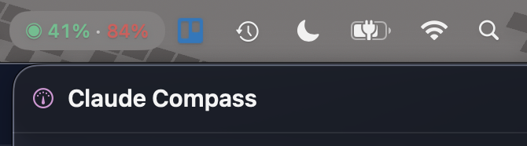
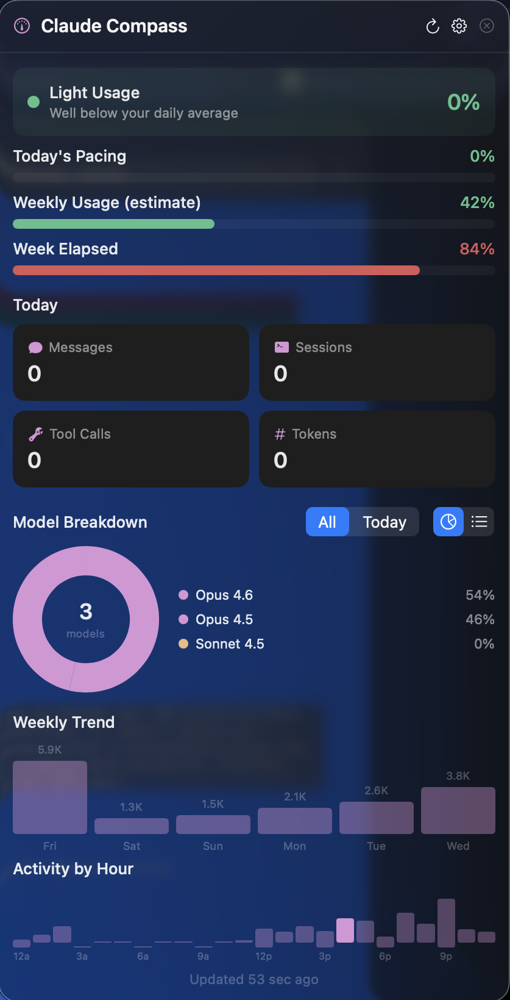

# Claude Compass

A macOS menu bar app that tracks your [Claude](https://claude.ai) AI usage in real time.

Claude Compass reads the local stats cache that Claude Code writes to `~/.claude/stats-cache.json` and displays pacing, message counts, model breakdowns, and more — right in your menu bar.

<p align="center">
  
</p>

<p align="center">
  
  &nbsp;&nbsp;
  
</p>

## Features

- **Menu bar usage indicator** — color-coded percentage that shows daily or weekly pacing at a glance
- **Dashboard popover** — today's messages, sessions, tool calls, and token counts
- **Weekly pacing** — estimated weekly usage vs. elapsed time in your billing period
- **Model breakdown** — per-model message and token counts
- **Hourly distribution** — activity chart across the day
- **Weekly trend** — 7-day activity overview
- **Web usage** (optional) — remaining API messages and reset time via Anthropic API
- **Notifications** — configurable alerts when usage crosses a threshold
- **Launch at login** — start automatically with macOS
- **Configurable reset schedule** — match your Claude plan's weekly reset day and hour

## Requirements

- macOS 14.0 (Sonoma) or later
- [Claude Code](https://docs.anthropic.com/en/docs/claude-code) installed (generates the stats cache file)
- Xcode 16+ and [XcodeGen](https://github.com/yonaskolb/XcodeGen) (to build from source)

## Installation

### Build from source

```bash
# Clone the repository
git clone https://github.com/Joe2Code/ClaudeCompass.git
cd ClaudeCompass

# Install XcodeGen if you don't have it
brew install xcodegen

# Generate the Xcode project and build
xcodegen generate
xcodebuild -project ClaudeCompass.xcodeproj -scheme ClaudeCompass -configuration Release build

# The built app is in DerivedData — or open the .xcodeproj in Xcode and run
```

### Run from Xcode

1. Run `xcodegen generate` in the project root
2. Open `ClaudeCompass.xcodeproj`
3. Select the **ClaudeCompass** scheme and press **Run**

The app appears as an icon in your menu bar (no Dock icon).

## Usage

Once running, Claude Compass shows a color-coded usage percentage in the menu bar:

| Color | Meaning |
|-------|---------|
| Green | Usage is low relative to time elapsed |
| Yellow | Usage is moderate |
| Red | Usage is high — approaching your limit |

Click the menu bar item to open the dashboard with detailed stats.

### Display modes

Open **Settings** (gear icon in the dashboard) to choose a display mode:

| Mode | Menu bar shows |
|------|---------------|
| **Weekly** | Weekly usage % and week elapsed % |
| **Daily** | Today's pacing % |
| **Dual** | Daily % and weekly % |
| **Icon Only** | Colored status dot only |

### Web usage (optional)

To see remaining API messages from Anthropic, go to **Settings > API** and enter your session key. Credentials are stored in the macOS Keychain.

### Weekly reset

Set your plan's reset day and hour in **Settings > General > Weekly Reset** so the weekly pacing calculation matches your actual billing cycle.

## Architecture

- **Swift 6** with strict concurrency
- **SwiftUI** with `@Observable` (requires macOS 14+)
- **MenuBarExtra** with `.window` style
- **XcodeGen** for project generation (`project.yml`)
- **No App Sandbox** — required to read `~/.claude/stats-cache.json`
- **LSUIElement** — menu bar only, no Dock icon

## Privacy

Claude Compass is designed to be privacy-respecting. See [PRIVACY.md](PRIVACY.md) for details.

**TL;DR:** All data stays on your Mac. The app reads one local file, optionally calls the Anthropic API with credentials you provide, and stores settings in UserDefaults and Keychain. No telemetry, no analytics, no data leaves your machine unless you configure the optional API feature.

## License

[MIT](LICENSE)
